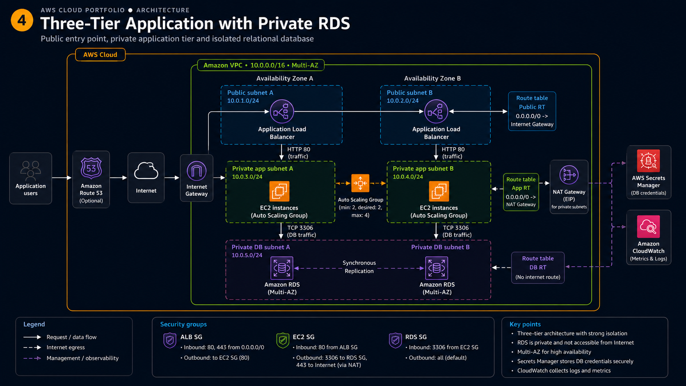

# **Three-Tier Application with Private RDS**

## Goal

Project 3 ended with a web tier that was already highly available: an Application Load Balancer
in public subnets, an Auto Scaling group of EC2 instances in private subnets, no public IP
anywhere behind the load balancer. What it did not have was state. Nothing was stored, so
nothing had to be protected.

Here I added the layer that changes the whole security conversation: a relational database.
The architecture becomes three tiers — the load balancer as the public entry point, the
application instances in the middle, Amazon RDS for MySQL at the bottom — and each tier only
talks to the one next to it. The database sits in its own pair of subnets that have no route to
the Internet at all, accepts connections only from the application security group, and its
master password is never written down anywhere: it lives in AWS Secrets Manager and the
instances read it through an IAM role.

The architecture was built by hand from the AWS Console in `eu-west-2`, so that every component
was understood before being automated. The same architecture is then defined as Infrastructure
as Code in [`terraform/`](terraform/).

## Architecture



```text
Internet
   |
Internet Gateway
   |
Application Load Balancer
Public subnet A / Public subnet B
   |
Target group
   |
Auto Scaling group
   |
EC2 A / EC2 B
Private app subnet A / Private app subnet B
   |
TCP 3306
   |
Amazon RDS for MySQL
Private DB subnet A / Private DB subnet B
```

Three things in the diagram are not part of what I deployed, and I would rather say so than let
the picture speak for me:

* **Amazon Route 53** is marked *Optional* in the diagram. There is no custom domain in this
  lab: the application is reached on the DNS name of the load balancer.
* **RDS is drawn as Multi-AZ**, with synchronous replication to a standby. The DB subnet group
  spans both Availability Zones, so the deployment is **Multi-AZ ready** and switching it on is
  a single setting — but the instance I actually created is **Single-AZ**, to keep the cost of
  a lab down. There is no standby running.
* The legend shows **HTTPS 443** on the ALB security group and **restrictive outbound rules**
  on the instances. Neither is what I built: the listener is HTTP on port 80, and outbound
  rules were left at the default "allow all" while I was still deploying and testing.

## Repository Layout

```text
.
├── README.md                            this file: the architecture and what was verified
├── architecture-diagram.png
├── user-data/
│   ├── install-apache.sh                bootstrap script as deployed from the Console
│   ├── install-apache-cloudwatch.sh     same script plus the CloudWatch Agent, see below
│   └── amazon-cloudwatch-agent.json     the agent configuration on its own, for reference
└── terraform/                           the same architecture as Infrastructure as Code
    └── README.md                        how to run it, file by file
```

## AWS Services Used

* **Amazon VPC** — the private network everything lives in: six subnets, three route tables and
  the gateways.
* **Application Load Balancer** — the only public entry point, spread across both Availability
  Zones.
* **Amazon EC2 and EC2 Auto Scaling** — the application tier, and what keeps two instances of it
  alive.
* **Amazon RDS for MySQL** — the managed database, in private subnets with no public access.
* **AWS Secrets Manager** — where the database master credentials are stored and rotated by RDS
  itself.
* **AWS IAM** — the role the instances assume, with one inline policy scoped to one secret.
* **AWS Systems Manager** — Session Manager, for administrative access without SSH.
* **Amazon CloudWatch** — metrics, the CPU alarm, and the log groups the Apache logs go to.
* **Amazon SNS** — the topic the alarm publishes to, with an email subscription.
* **NAT Gateway / Internet Gateway** — outbound access for the private application subnets, and
  Internet access for the public ones.

## Network Design

The VPC spans two Availability Zones and is cut into **three pairs of subnets**, one pair per
tier:

| Subnets | What lives there | Route for `0.0.0.0/0` |
|---|---|---|
| 2 public | ALB nodes, NAT Gateway | Internet Gateway |
| 2 private app | EC2 instances created by the Auto Scaling group | NAT Gateway |
| 2 private DB | the RDS DB subnet group | **none** |

The reason there are six subnets rather than four is the third route table. The application
instances need outbound Internet access — to install packages at first boot, to let the SSM
agent reach Systems Manager, and to call the Secrets Manager and CloudWatch endpoints — so
their route table points `0.0.0.0/0` at the NAT Gateway. The database needs none of that. Its
route table has only the local VPC route, which means an RDS instance there cannot start a
connection to the Internet and the Internet cannot reach it, whatever a security group might
say.

A DB subnet group is required by RDS and has to contain subnets in at least two Availability
Zones, even for a Single-AZ instance. That requirement is exactly what makes the deployment
Multi-AZ ready: AWS wants to know in advance where a standby would go.

The instances have **no public IPv4 address and no public DNS name**, and neither does RDS.
`Publicly accessible` is set to No, so the endpoint only resolves to a private address inside
the VPC.

## Security Design

Three security groups, chained so that each one names the previous one as its source instead of
an IP range:

```text
Internet
   |  HTTP 80 from 0.0.0.0/0
   v
ALB security group
   |  HTTP 80 from the ALB security group
   v
EC2 security group
   |  MySQL 3306 from the EC2 security group
   v
RDS security group
```

* The **ALB security group** is the only one that mentions `0.0.0.0/0`. It is the perimeter.
* The **EC2 security group** allows port 80 only from the ALB security group, so a packet that
  did not come through the load balancer has no way in — there is no path from the Internet to
  those subnets anyway, but the two controls are independent and both are worth having.
* The **RDS security group** allows TCP 3306 only from the EC2 security group. Not from a CIDR
  block, not from my laptop.

Referencing a security group instead of an address is what makes this survive Auto Scaling.
Instances are replaced, private IPs change, and the rule keeps meaning "whatever is currently
running in the application tier".

Security groups are stateful, which is why none of these rules has a matching reply rule: the
response to an allowed inbound connection is allowed back out automatically.

**Being honest about outbound:** I left the outbound rules permissive during the deployment,
which is the AWS default. A hardened version would restrict the instances' egress to 3306
towards the RDS security group plus 443 for the AWS endpoints, and the ALB's egress to 80
towards the instances. I have not done that yet, so I am not claiming it.

Port 22 is not open anywhere and no key pair is attached to the launch template. Administration
goes through **Session Manager**, which opens a shell over the SSM agent's outbound connection
and needs no inbound rule at all.

## Application Tier

The launch template defines an instance: Amazon Linux, the EC2 security group, the instance
profile, and the User Data in [`user-data/install-apache.sh`](user-data/install-apache.sh),
which installs Apache, enables it and writes a test page. No key pair, and **no subnet** — that
choice belongs to the Auto Scaling group, which is what spreads instances across the two
Availability Zones.

User Data only runs at the first boot of an instance. It is provisioning, not configuration
management: editing the script does not touch the instances already running, only the ones
launched afterwards.

The Auto Scaling group runs across the two private application subnets, with minimum 2,
desired 2, maximum 4, and registers the instances it creates in the target group by itself.

One naming detail I am documenting rather than hiding: the Auto Scaling group is called
**`project4-launch-template`**. That is the name the console suggested when I created the group
from the template, and it reads like the name of a launch template, which is confusing. It is
the Auto Scaling group. The CloudWatch alarm dimension later in this README uses that same name
because that is what the group is actually called.

The load balancer has an HTTP listener on port 80 forwarding to the target group
**`project4-web-tg`**: target type *Instances*, protocol HTTP, port 80, health check on `/`.
A target group is not a server and not a hop — it is the list of backend targets plus the
health check that decides which of them the load balancer may use.

## Database Tier

| Setting | Value | Why |
|---|---|---|
| Engine | MySQL Community Edition | the SAA-level default relational engine |
| Class | `db.t4g.micro` | smallest burstable Graviton class, cheapest thing that runs |
| Storage | General Purpose SSD (gp3) | no Provisioned IOPS: this lab has no IO profile to speak of |
| Deployment | **Single-AZ** | cost. Multi-AZ doubles the instance cost for a lab that is deleted the same day |
| Public access | No | the endpoint only resolves inside the VPC |
| Subnet group | the two private DB subnets | required by RDS, and what makes Multi-AZ possible later |
| Credentials | managed in Secrets Manager | see below |

The interesting question here is not how to create the database, it is what RDS gives me that
MySQL installed on an EC2 instance would not: backups, patching, failover, storage growth and
metrics are the service's problem instead of mine. What I give up is root on the host — no
shell on the database server, only the parameters and the endpoint.

In production the same design would be flipped to Multi-AZ, and the change is genuinely one
setting because the subnet group already spans two zones. Multi-AZ is not a read-scaling
feature: the standby serves no traffic, it exists so that a failure promotes it and the
endpoint keeps resolving. Read replicas are the other tool, for a different problem.

## Secrets Manager and IAM

The master password is not in the source code, not in User Data, not in this repository and not
in a configuration file. RDS created the secret and manages it in **AWS Secrets Manager**, and
the application reads it at runtime.

The instances get permission to do that through the role **`project4-ec2-role`**, attached to
the launch template as an instance profile:

* `AmazonSSMManagedInstanceCore` — what Session Manager needs.
* `CloudWatchAgentServerPolicy` — what the CloudWatch Agent needs to publish logs and metrics.
* one **inline policy**, which is the part that matters:

```json
{
  "Version": "2012-10-17",
  "Statement": [
    {
      "Effect": "Allow",
      "Action": "secretsmanager:GetSecretValue",
      "Resource": "arn:aws:secretsmanager:eu-west-2:<ACCOUNT_ID>:secret:<RDS_SECRET_NAME>-<SUFFIX>"
    }
  ]
}
```

The `Resource` is the ARN of that one secret, not `*`. If the account later holds twenty
secrets, these instances can still read exactly one of them. That is least privilege in a form
I can point at during an interview: not a principle, a line in a policy document.

```text
EC2 instance
   → instance profile → project4-ec2-role
   → sts temporary credentials from the instance metadata service
   → secretsmanager:GetSecretValue on one specific secret ARN
```

No IAM user, no access key and no password is stored on the instances. The credentials they use
are temporary and rotated by AWS.

## Observability

What is running today:

* **CloudWatch metrics.** EC2 publishes `CPUUtilization` and the rest of the standard set
  automatically, and I verified the metric for the Auto Scaling group
  `project4-launch-template` in the console.
* **A CloudWatch alarm** on `CPUUtilization`, namespace `AWS/EC2`, dimension
  `AutoScalingGroupName = project4-launch-template`, statistic Average, period 5 minutes,
  threshold **> 70%**.
* **An SNS topic `project4-alerts`**, with an email subscription as the endpoint. The alarm
  publishes to the topic when it goes into ALARM.

```text
EC2 / Auto Scaling group
   ├── metrics ──→ CloudWatch metrics ──→ alarm (CPU > 70%) ──→ SNS project4-alerts ──→ email
   └── Apache logs ──→ CloudWatch Logs        (the part described in the next section)
```

Other services already publish their own metrics, and I want to be clear that having them is
not the same as monitoring them — I have **not** built alarms on any of these:

* **ALB** — `RequestCount`, `TargetResponseTime`, `HTTPCode_ELB_5XX_Count`,
  `HTTPCode_Target_5XX_Count`, `ActiveConnectionCount`.
* **Target group** — `HealthyHostCount`, `UnHealthyHostCount`. In a real deployment
  `UnHealthyHostCount >= 1` is the alarm I would want before a CPU alarm.
* **RDS** — `CPUUtilization`, `DatabaseConnections`, `FreeStorageSpace`, `FreeableMemory`,
  `ReadLatency` / `WriteLatency`, `BurstBalance`.
* **EC2** — memory and disk usage are *not* in the standard set. They come from the CloudWatch
  Agent, because the hypervisor cannot see inside the instance.

## CloudWatch Logs — the part still to apply

**Status: not applied yet.** The IAM role already carries `CloudWatchAgentServerPolicy`, so the
permissions are in place, but no log group exists yet and the agent is not installed on the
running instances. Everything below is the procedure, written before doing it, and this section
will say "applied" only once it is.

Why it matters here more than anywhere else in the project: the instances are cattle. The Auto
Scaling group can terminate one at any moment, and the `/var/log/httpd/` directory goes with
it. Centralising the logs means the evidence of what happened outlives the instance that
produced it.

The design:

```text
EC2 A ──┐
        ├──→ /project4/apache/access   stream: <instance-id>
EC2 B ──┘    /project4/apache/error    stream: <instance-id>
```

Two log groups, one per log file, and one stream per instance inside each of them. The stream
name comes from the `{instance_id}` placeholder, which the agent expands at runtime — so a
brand new instance gets its own stream without anybody configuring it.

**The configuration is in the launch template, not on the instances.** Installing the agent by
hand over Session Manager would work until the next instance replacement, and then it would
quietly stop working on the new instance. That is the mistake this section exists to avoid.

Steps:

1. Take [`user-data/install-apache-cloudwatch.sh`](user-data/install-apache-cloudwatch.sh). It
   is the deployed script plus three things: `amazon-cloudwatch-agent` in the `dnf install`
   line, the agent configuration written to
   `/opt/aws/amazon-cloudwatch-agent/etc/amazon-cloudwatch-agent.json`, and the
   `amazon-cloudwatch-agent-ctl -a fetch-config -m ec2 -c file:... -s` call that loads it and
   starts the agent.
2. In **EC2 → Launch templates → project4 template → Actions → Modify template (create new
   version)**, paste that script into *Advanced details → User data*, and save. Set the new
   version as the template default.
3. In **Auto Scaling groups → project4-launch-template → Edit**, make sure the group uses
   `$Latest` or the new version number.
4. Roll the instances so they pick it up. Either **Instance refresh** on the Auto Scaling group
   (with a minimum healthy percentage of 50, so one instance keeps serving while the other is
   replaced), or simply terminate one instance at a time and let the group replace it.
5. Check **CloudWatch → Log groups**. `/project4/apache/access` and `/project4/apache/error`
   are created by the agent on first write, each with one stream per instance ID.
6. Generate traffic through the load balancer DNS name and confirm the requests appear in the
   access log stream.
7. Confirm the **retention** on both groups is 7 days and not *Never expire*. The agent
   configuration asks for it, but retention on an existing group is not changed retroactively —
   set it in the console if the group was created before.

The same configuration is already wired into the Terraform in this repository, where the log
groups are declared explicitly with their retention instead of being created implicitly by the
agent.

## Traffic Flow

Inbound, from a client:

```text
Client
→ Internet Gateway
→ Application Load Balancer   (public subnets, ALB security group)
→ Target group                (healthy targets only)
→ EC2 instance                (private app subnet, port 80 from the ALB security group)
→ RDS endpoint                (private DB subnet, port 3306 from the EC2 security group)
```

Outbound, from an instance:

```text
EC2 instance
→ private app route table (0.0.0.0/0 → NAT Gateway)
→ NAT Gateway             (public subnet, Elastic IP)
→ Internet Gateway
→ Internet / AWS public endpoints (Systems Manager, Secrets Manager, CloudWatch)
```

From the database:

```text
RDS instance
→ DB route table (local VPC route only)
→ nowhere
```

## How It Was Built

The order the components were created in, because it is dictated by their dependencies:

1. VPC, then the six subnets across two Availability Zones.
2. Internet Gateway attached to the VPC, then the NAT Gateway with its Elastic IP in a public
   subnet.
3. The three route tables — public to the Internet Gateway, application to the NAT Gateway,
   database with no `0.0.0.0/0` route — and their subnet associations.
4. The three security groups. The ALB one first, because the EC2 one references it, and the EC2
   one before the RDS one for the same reason.
5. DB subnet group over the two private DB subnets, then the RDS MySQL instance with
   `Publicly accessible = No` and credentials managed in Secrets Manager.
6. The IAM role `project4-ec2-role` with the two managed policies and the inline policy scoped
   to the secret ARN — this has to exist before the launch template that references it.
7. Target group `project4-web-tg`, then the internet-facing Application Load Balancer in the
   two public subnets with an HTTP:80 listener forwarding to it.
8. Launch template, then the Auto Scaling group across the two private application subnets,
   attached to the target group.
9. SNS topic `project4-alerts` and the email subscription — confirmed from the email before it
   can receive anything — then the CloudWatch alarm pointing at it.

## Current Validation Status

Being precise about what I have actually seen.

Verified:

* the Auto Scaling group created the instances itself, in the two private application subnets;
* neither instance has a public IPv4 address, which is the point of those subnets;
* both instances were registered in `project4-web-tg` automatically and the target group
  reported them **Healthy**, so the load balancer is able to route to the application tier;
* the RDS instance is private and not publicly accessible;
* the RDS security group allows TCP 3306 only from the EC2 security group;
* Secrets Manager holds the RDS-managed credentials;
* the instances carry `project4-ec2-role`;
* CloudWatch receives `CPUUtilization` for the Auto Scaling group `project4-launch-template`;
* the CPU alarm exists and is wired to the SNS topic `project4-alerts`.

Not verified yet:

* the **application has not been connected to the database**. The instances serve a static test
  page; nothing in it reads the secret and opens a MySQL connection. What I have proven is that
  the *path* exists and is scoped correctly, not that a query has run over it.
* the CloudWatch Logs configuration described above is **not applied**.
* I have not fired the alarm on purpose, so I have not seen the notification email arrive.
* I have not tested resilience: terminating an instance and watching the group replace it,
  stopping Apache to see a target go unhealthy, or opening a Session Manager shell.

So the infrastructure is built and correctly isolated, the web tier answers through the load
balancer, and the end-to-end application-to-database test is the next step.

## Cleanup

Nothing in this project is covered by a free allowance the way project 1 was. The NAT Gateway
is charged per hour plus data processed, the load balancer is charged per hour whether it gets
traffic or not, RDS is charged per hour, and its storage and backups are charged even when the
instance is stopped. A stopped RDS instance also restarts itself after seven days. I delete
everything the same day I build it.

Order matters:

1. Delete the **Auto Scaling group first**, otherwise it launches replacements for the instances
   being terminated.
2. Delete the load balancer, then the target group.
3. Delete the **RDS instance** — skipping the final snapshot for a lab, otherwise the snapshot
   is billed — and then the DB subnet group.
4. Delete the **NAT Gateway**, then release its Elastic IP: an unattached Elastic IP is billed
   on its own.
5. Delete the launch template, the security groups, the route tables, the subnets, the Internet
   Gateway, and finally the VPC.
6. Delete the CloudWatch alarm, the log groups if they were created, and the SNS topic and
   subscription.
7. Delete the Secrets Manager secret. It is scheduled for deletion with a recovery window
   rather than removed immediately, which is worth knowing before wondering why it is still
   listed.
8. Check that no instance and no orphan EBS volume or snapshot is left.

## What I Learned

* Three tiers is not three groups of servers, it is three blast radiuses. What makes the
  database tier a tier is that its route table has no way out and its security group names one
  source.
* A DB subnet group has to span two Availability Zones even for a Single-AZ instance, because
  AWS needs to know where a standby would go before you ask for one.
* Multi-AZ is availability, not performance: the standby answers nothing. Read replicas are the
  answer to a different question.
* Chaining security groups by reference instead of by CIDR is what makes a rule survive an
  instance being replaced.
* A secret is only as private as the policy that reads it. Storing a password in Secrets Manager
  and then granting `secretsmanager:GetSecretValue` on `*` gives away most of the benefit.
* An instance profile is how an EC2 instance receives a role, and the credentials it gets are
  temporary — there is nothing on disk to steal.
* Instance logs are as disposable as the instance. If the Auto Scaling group can terminate it,
  the logs have to leave it.
* Configuring an agent by hand over Session Manager works exactly until the next instance
  replacement. The reproducible place for it is the launch template.
* Standard EC2 metrics stop at the hypervisor boundary: CPU is free, memory and disk need an
  agent inside the instance.

## What I Need to Be Able to Explain

1. What the third pair of subnets buys me, and why four subnets would not have been enough.
2. Why RDS is not publicly accessible, and the two independent controls that keep it that way.
3. Why the RDS security group references the EC2 security group instead of a CIDR block.
4. What managed RDS gives me over MySQL installed on EC2, and what I give up.
5. The difference between Multi-AZ and a read replica, and which problem each one solves.
6. Why the deployment is Multi-AZ ready even though the instance is Single-AZ.
7. How an EC2 instance reads a secret with no credentials stored on it, from the instance
   profile to the temporary credentials.
8. Why the inline policy names one secret ARN, and what would be wrong with `Resource: "*"`.
9. How Session Manager replaces SSH, and why that lets the instances have no inbound rule
   besides port 80.
10. Why the Apache logs go to CloudWatch Logs, and why the agent is configured in the launch
    template rather than on the instances.
11. Which metric I would alarm on first in a real deployment, and why it is probably not CPU.
12. What is still a single point of failure in this architecture.

## Future Improvements

* Connect the application to the database for real: read the secret from Secrets Manager at
  runtime, open a connection, and serve something that proves it.
* Apply the CloudWatch Logs configuration above, and add an alarm on
  `UnHealthyHostCount >= 1` and on RDS `FreeStorageSpace`.
* Turn on RDS Multi-AZ, and enable storage encryption at rest.
* An HTTPS listener on 443 with a certificate from AWS Certificate Manager, and a custom domain
  in Route 53 in front of the load balancer.
* Tighten the outbound security group rules to exactly what each tier needs.
* One NAT Gateway per Availability Zone, so a zone failure does not take the outbound path of
  the other zone with it.
* VPC endpoints for Secrets Manager, Systems Manager and CloudWatch, so that traffic to those
  services never leaves the VPC and does not pay NAT Gateway data processing.
* A defined backup retention window and a tested restore, rather than the default.
* A remote Terraform backend with state locking, instead of local state.

**In one sentence:** I built a three-tier architecture in a custom VPC across two Availability
Zones — an internet-facing Application Load Balancer in public subnets, an Auto Scaling group of
EC2 instances with no public IP in private application subnets, and a private Single-AZ RDS
MySQL instance in database subnets with no Internet route — with the tiers chained by security
group references, the database password held in Secrets Manager and readable through an IAM
role scoped to that one secret, administration through Session Manager instead of SSH, and a
CloudWatch CPU alarm publishing to an SNS topic; the web tier is healthy behind the load
balancer, and connecting the application to the database and shipping the Apache logs to
CloudWatch Logs are what I do next.
